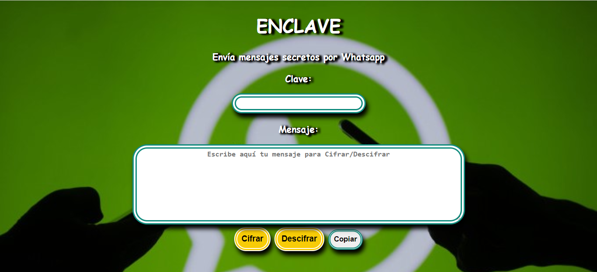
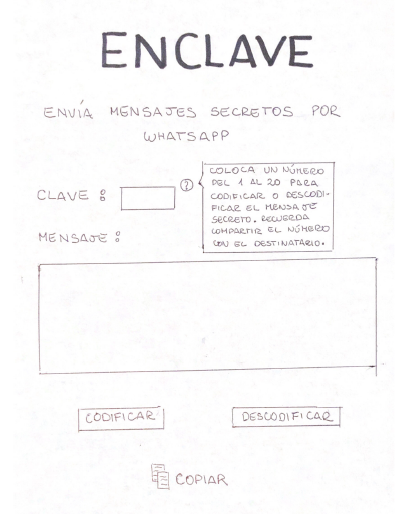
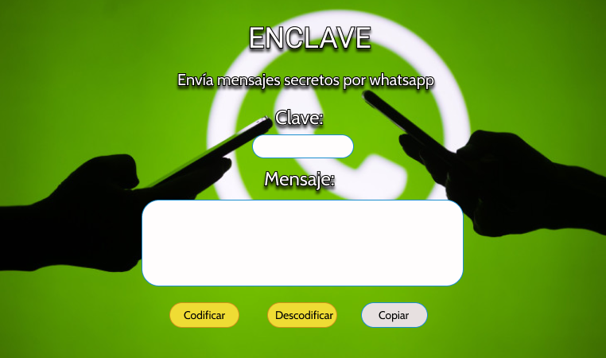

# Bienvenidx al repositorio oficial de Enclave
___

## Instalación:

Debes tener instalado ENCLAVE luego de haber clonado el proyecto desde GitHub y ejecutar el siguiente comando:

*Install Enclave*

Una vez ejecutado, se creará la carpeta LIM013-cipher el cual contiene los códigos.

## Introducción:

Enclave es el primer proyecto diseñado dentro del Bootcamp de Laboratoria :thumbsup:. El cual utiliza el *Cifrado Cesar* como modelo para realizar el cifrado del mensaje escrito por el usuario. Asimismo, se desarrolla conocimientos en JavaScript para dar vida al proyecto.

## ¿Qué es Enclave?

Enclave te ayudará a enviar mensajes secretos por whatsapp o cualquier otra red social que utilices; para poder proteger la información enviada.

**¿Cómo funciona?**

- :point_right: Para usar Enclave iniciarás colocando una *Clave* que incluya solo números (el número que se te ocurra, no hay límites!)
- :point_right: Ahora escribe el *mensaje* que deseas Codificar 
- :point_right: Click en el botón *Cifrar*
- :point_right: Muy bien! verás que tu mensaje original ha cambiado a otro, donde las letras no son las mismas
- :point_right: Copia el mensaje con el botón *Copiar*
- :point_right: Listo! ya tienes un mensaje cifrado. Cuando envíes el mensaje, recuerda compartir tu clave. De esta manera, quien recibió el mensaje pueda *Descifrarlo* 

## Investigación UX:

1. **Usuarios y objetivos:** Dentro de los usuarios incluimos a personas de todas la edades y situaciones-socioeconómicas, con acceso a internet. El objetivo de Enclave es la protección de información enviada a través del aplicativo whatsapp y redes sociales.

2. **Solución de problemas:** El presente proyecto permite dar solución a los inconvenientes de enviar mensaje con información importante por medio de Whatsapp; aplicativo usado por el 64% de la población en Latinoamerica. Debido al uso constante estamos vulnerados a ser víctimas del robo de celulares y hackers de redes sociales, por ello es importante contar con una app web que permita cifrar nuestros mensajes compartidos en los chats. De esta manera brindaremos solución a los usuarios y usuarios bussiness. 

>El 64% de la población Lationamericana usa Whatsapp:
>https://es.statista.com/grafico/17500/uso-de-whatsapp-en-america-latina/

3. **Prototipo en papel:** Enclave al inicio contaba con el siguiente prototipo de papel, el cual fue modificado para mejorar la experiencia del usuario, en el transcurso de la creación del proyecto:

4. **Feedback recibido:** Se recomienda la integración de más códigos ASCII para que el cifrado sea más completo y no se limite a una cierta cantidad de caracteres
5. **Prototipo final:** La app web ha sido diseñada para el rápido uso del usuario. En una sola vista podrá cifrar/descifrar el mensaje obtenido. A continuación se muestra el prototipo de la app web:

